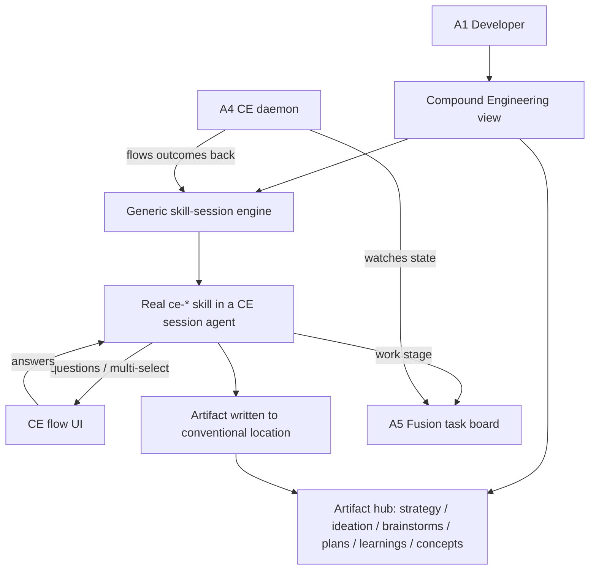

# Compound Engineering Plugin — Requirements

## Summary

A Fusion plugin that adds a dedicated **Compound Engineering** dashboard surface: browse every compound-engineering artifact and launch any `ce-*` stage as an interactive, in-dashboard session that reuses the real skills. The plugin manages its own skill install/updates, the work stage lands tasks on the existing kanban, and a background **CE daemon** keeps the board and the CE flow in sync both ways. It runs alongside Fusion's native pipeline rather than replacing it.

## Problem Frame

Compound engineering today is a set of CLI slash-commands (`ce-ideate`, `ce-brainstorm`, `ce-plan`, `ce-work`, `ce-code-review`, `ce-compound`, and more) that an operator runs in a terminal. The valuable outputs — strategy, ideations, brainstorms, plans, learnings, concepts — land as markdown scattered across `docs/`, with no unified place to see them, no visual way to start a stage, and no connection between a finished plan and the work that should follow it. The methodology's whole premise is that work *compounds* — each unit improves the system that does the next — yet that compounding is invisible and the loop between "planned" and "done" is stitched together by hand.

Fusion already solves the adjacent half: a multi-surface board where agents plan, execute, review, and merge tasks, with an interactive planning/interview UI. The gap is that compound engineering and Fusion are two separate worlds. Bringing the CE flow onto Fusion's surfaces — while reusing the actual skills so it improves as they do — closes that gap and makes compounding a visible, driven loop instead of a manual one.

This is deliberately an **ecosystem/dogfooding bet**: it advances the "Ecosystem & adaptability" strategy track and aims to lift task-completion-rate by closing the plan→work→learn loop, rather than directly moving the headline fleet metrics (concurrent sessions, active nodes). That trade is intentional — see Sources on why this theme is being revisited.

## Key Decisions

- **Reuse the real `ce-*` skills, never reimplement.** The plugin invokes the actual skills via Fusion agent sessions. This is the load-bearing bet: when compound engineering improves, the plugin improves for free. The cost is that UI fidelity is bounded by what a generic question bridge can render — and real skills do more than ask questions (file edits, sub-agent spawns, plan-mode approval), so the bridge may not cover their primary interaction mode. The graceful-degradation fallback (below) must not silently become the common case.

- **A generic skill-session engine + artifact hub is the spine.** Rather than build a bespoke screen per stage, one engine launches any registered stage and one hub auto-discovers artifacts. "Support every stage" becomes registration/config, not a dozen separate builds — the only way "all of it" is tractable.

- **A new CE flow UI, decoupled from the planning components.** The interactive session UI is the plugin's own, drawing on the planning/interview flow for interaction patterns but not depending on `PlanningModeModal` or mission internals. It aims to reuse the underlying agent-session **question/answer protocol** (the transport that carries a skill's questions and the user's answers) so that only the renderer is new. **Unverified — gating spike:** today the only structured Q/A transport (`AiSessionStore` / `PlanningQuestion`) is dashboard-internal and is not exposed through the plugin SDK, whose `createAiSession` offers only a synchronous `prompt()` + read-only `messages` loop. Whether the transport can be reused — or must be built/exposed as foundational SDK work — must resolve **before** the "registration, not build" economics below can be claimed.

- **The plugin owns `ce-*` skill install and updates, by bundling.** A pinned copy of the skills ships inside the plugin package and is refreshed when the plugin updates — fully self-contained, version-locked, no runtime fetch. A session never fails for lack of skills, and the bundled copy must never clobber an operator's own globally-installed compound-engineering plugin.

- **Bidirectional board↔CE sync.** Work flows out to the board *and* board outcomes flow back into the CE pipeline. The capability is "the CE flow reacts to board task-state transitions"; the mechanism — a standalone daemon vs. the SDK's existing `onTaskMoved`/`onTaskCompleted` lifecycle hooks vs. the scheduler — is left to planning, not baked into the requirement.

- **Runs alongside Fusion's pipeline; work lands as normal tasks.** CE work appears as ordinary Fusion tasks tagged CE-originated and executed by the existing lifecycle. A CE pipeline does not become a Fusion *mission* in v1.

- **Graceful degradation.** A stage whose interaction the generic bridge can't render falls back to a plain agent/chat view rather than blocking the stage.

## Actors

- A1. Developer — the Fusion solo-dev persona; opens the CE view, starts sessions, answers interactive prompts, reviews artifacts and board work.
- A2. `ce-*` skill — the reused methodology logic (markdown skill) that drives a stage's questions, reasoning, and artifact output.
- A3. CE session agent — the Fusion agent the plugin spawns to run a skill in the project repo, surfacing its questions to the UI.
- A4. CE daemon — background watcher that keeps the board and CE flow in sync bidirectionally.
- A5. Fusion task board — the existing kanban/lifecycle that executes work-stage tasks.

## Requirements

**Compound Engineering surface**
- R1. The plugin registers a primary dashboard view labeled "Compound Engineering."
- R2. The view surfaces existing CE artifacts discovered from their conventional repo locations: `STRATEGY.md`, `docs/ideation/`, `docs/brainstorms/`, plan documents, `docs/solutions/` (learnings), and `CONCEPTS.md`.
- R3. Each artifact is browsable/readable in the view, grouped or navigable by stage/type.
- R4. From the view, the developer can initiate any supported CE stage as a new session.
- R20. The hub defines explicit states: empty / first-run (no CE artifacts found in any conventional location), partial discovery (some categories present, others empty), and unreadable/malformed artifact — each specifying what is shown and the primary action offered. The empty/first-run state orients a developer installing the plugin on a fresh project.

**Interactive skill sessions**
- R5. A generic skill-session engine launches a registered `ce-*` stage as a Fusion agent session that loads and runs the real skill.
- R6. The session renders the skill's interactive prompts — questions, single-select, multi-select, and free-text answers — in the plugin's own CE flow UI, and feeds answers back to the running skill.
- R7. Supporting a new stage is a registration step (skill id + artifact location + presentation metadata), not a new bespoke screen.
- R8. When the skill emits an interaction the CE flow UI cannot render, the session falls back to a plain agent/chat view so the stage still completes.
- R9. The CE flow UI is decoupled from `PlanningModeModal` and mission-interview components; it reuses only the underlying agent-session question/answer protocol.
- R10. A completed session writes/updates its artifact in the conventional location and the surface reflects it.
- R21. The session defines lifecycle states: launching (agent spawning), active, agent error mid-session, user-interrupted, and completed. The interrupted and error states must avoid silent work loss — define whether progress is auto-saved and whether a resume prompt appears on the developer's next visit to that stage.

**Skill lifecycle management**
- R11. The plugin bundles a pinned copy of the `ce-*` skills it depends on and installs them from that bundle (no runtime fetch).
- R12. The bundled skills install to a plugin-local location (never a global skills prefix), so they do not overwrite or conflict with an operator's separately-installed compound-engineering plugin.
- R13. Updating the plugin refreshes its bundled skills to the version pinned in that release.

**Work bridge and bidirectional sync**
- R14. The work stage produces Fusion tasks on the existing board, tagged as CE-originated and traceable to their originating CE pipeline/artifact.
- R15. The CE flow reacts to board task-state transitions and stays in sync with them (mechanism — daemon vs. lifecycle hooks vs. scheduler — decided in planning).
- R16. When CE-originated board work reaches a terminal/reviewed state, the daemon flows the outcome back into the CE pipeline (advancing or feeding the next stage).
- R17. Sync is bidirectional: changes initiated in the CE flow propagate to the board, and board outcomes propagate back to the CE flow.

**Packaging and integration**
- R18. The plugin is a standard `fusion-plugin-*` package using the manifest's `dashboardViews`, `settingsSchema`, and background/scheduled-work facilities.
- R19. The plugin operates alongside Fusion's native pipeline without replacing or disabling it.

## Key Flows

- F1. Launch an interactive CE session
  - **Trigger:** A1 picks a stage (e.g., ideate, brainstorm) from the CE view.
  - **Actors:** A1, A3, A2
  - **Steps:** Plugin spawns A3 with the real skill (A2) loaded → skill emits questions → CE flow UI renders them → A1 answers → answers feed back → skill produces its artifact.
  - **Outcome:** Artifact written to its conventional location and reflected in the surface.
  - **Covered by:** R4, R5, R6, R9, R10

- F2. Work stage lands tasks on the board
  - **Trigger:** A CE stage reaches the work phase (e.g., from a completed plan).
  - **Actors:** A1, A3, A5
  - **Steps:** Work-stage session creates Fusion tasks tagged CE-originated → tasks appear on the kanban → executed by the normal Fusion lifecycle.
  - **Outcome:** CE work is visible and running on the board.
  - **Covered by:** R14, R19

- F3. Board outcome flows back into the CE flow
  - **Trigger:** A CE-originated task changes state (e.g., completed/reviewed).
  - **Actors:** A4, A5
  - **Steps:** A4 observes the task-state change → reconciles it against the CE pipeline → advances or feeds the next CE stage.
  - **Outcome:** The CE flow reflects real board progress without manual reconciliation.
  - **Covered by:** R15, R16, R17

- F4. Skill install/update on plugin install or upgrade
  - **Trigger:** Plugin is installed or upgraded.
  - **Actors:** A1 (initiates), plugin
  - **Steps:** Plugin checks for its managed skills → installs or updates them → leaves any operator-installed global compound-engineering plugin untouched.
  - **Outcome:** Sessions can run without a separate skill-install step.
  - **Covered by:** R11, R12, R13

## Visualization

## Acceptance Examples

- AE1. Graceful degradation
  - **Covers R8.**
  - **Given** a CE session whose skill emits an interaction the CE flow UI does not support,
  - **When** that interaction fires,
  - **Then** the session presents a plain agent/chat fallback and the stage can still be completed.

- AE2. Skill management does not clobber a global install
  - **Covers R11, R12.**
  - **Given** the operator already has the compound-engineering plugin installed globally,
  - **When** the Fusion plugin installs/updates its managed skills,
  - **Then** the operator's global install is left intact and unmodified.

- AE3. Board outcome advances the CE flow
  - **Covers R16, R17.**
  - **Given** a CE-originated task on the board,
  - **When** it reaches a completed/reviewed state,
  - **Then** the CE daemon flows the outcome back and the CE pipeline advances to or feeds the next stage without manual reconciliation.

## Success Criteria

- A skill-interaction audit of 2–3 real `ce-*` stages enumerates which interaction types each actually performs (questions vs. file edits vs. sub-agent spawns vs. plan approval). The share of stages the question bridge can render richly — versus those that fall back to the plain agent/chat view — is a measured v1 criterion, not a post-build discovery. If most valuable stages fall back to chat, the rich-UI premise is not met.

## Scope Boundaries

**Deferred for later**
- Full compounding **lineage-graph visualization** (artifact → artifact → tasks → learnings as a navigable map). The bidirectional sync it depends on is in scope; the visualization is north-star vision.
- **Bespoke per-stage flows** — native, stage-tailored UIs (e.g., ranked-ideas or approach-card views) for the richest stages.
- Modeling a CE pipeline as a Fusion **mission**.

**Outside this product's identity**
- Reimplementing skill logic natively in the plugin — defeats the reuse/compounding bet.
- Coupling the CE flow UI to `PlanningModeModal` or mission-interview internals.
- Replacing or bypassing Fusion's native task pipeline.

## Dependencies / Assumptions

- The Fusion plugin SDK supports primary `dashboardViews`, a `settingsSchema`, and background/scheduled work (verified against `plugins/fusion-plugin-reports/manifest.json`, which ships a dashboard view, settings, cron schedules, and a multi-agent review pipeline).
- A Fusion agent session can load and run the compound-engineering skills in the project repo (assumes the active runtime adapter exposes skills to the agent).
- The `ce-*` skills are **not in this repo** — they live in the external compound-engineering plugin. Their real interaction patterns (questions vs. file edits vs. sub-agents vs. plan approval) are therefore unverified against the question-bridge assumption, and the canonical bundle source must be identified before relying on them.
- The underlying agent-session question/answer protocol is reusable independent of the planning React components (assumption — the seam needs confirmation during planning; `PlanningModeModal`, `MissionInterviewModal`, `MilestoneSliceInterviewModal`, and `SkillMultiselect` exist as interaction precedents).
- The `ce-*` skills are bundled with the plugin (pinned per release); no external skill source or runtime fetch is assumed.

## Outstanding Questions

**Deferred to planning**
- The exact reuse seam for the agent-session question/answer protocol, separate from the planning UI components.
- Whether the CE daemon is a standalone process or piggybacks on Fusion's existing daemon/scheduler.
- The precise mapping of board events (task state transitions, review outcomes) to CE-stage transitions.
- Which CE stages ship in the first registration set and their presentation metadata.

## Sources / Research

- `plugins/fusion-plugin-reports/manifest.json` — precedent for a plugin contributing a primary dashboard view, a rich settings schema, cron-scheduled background work, and a multi-agent review/approval pipeline.
- `packages/dashboard/app/components/PlanningModeModal.tsx`, `MissionInterviewModal.tsx`, `MilestoneSliceInterviewModal.tsx`, `SkillMultiselect.tsx` — interaction-pattern inspiration for the CE flow UI (to draw from, not depend on).
- `packages/plugin-sdk/src/index.ts` — plugin definition/validation surface.
- `STRATEGY.md` — the "Ecosystem & adaptability" track (plugins, evolving workflows) this plugin advances.
- `docs/ideation/2026-06-02-open-ideation.md` — note: this ideation pass **deprioritized** the internal-facing compounding/DX theme (Rejection #3, "slot went to product-facing ideas"). This plugin revisits it deliberately as an ecosystem/dogfooding bet (see Problem Frame), not as one of that doc's top-ranked fleet-metric ideas.

## Deferred / Open Questions

### From 2026-06-02 review
- Back-sync state model (R16/R17): "flow back / advance the next stage" presumes a stateful, addressable pipeline object, but v1 declines to model a CE pipeline as a mission. Decide: define a minimal persisted pipeline-state record, or defer the flow-back half (R16/R17) to match the lineage-graph deferral, keeping only outbound R14 in v1. (This reopens the bidirectional-sync decision.)
- Artifact-hub information architecture: the primary navigation model (pipeline-ordered vs. type-grouped vs. recency-based). Left open, it defaults to a generic card grid that hides the compounding pipeline the product is meant to make visible.
- Concurrent sessions per stage: whether a stage can have multiple active sessions at once; if one-at-a-time, what the UI shows when a session for that stage is already running.
- Sync conflict resolution: which side is authoritative when a CE artifact and its board task change simultaneously (e.g., board authoritative for task state, CE flow authoritative for artifact content).
- Fallback-view interaction scope: what the plain agent/chat fallback exposes vs. suppresses, and whether it is visually marked as degraded mode so the developer knows.
