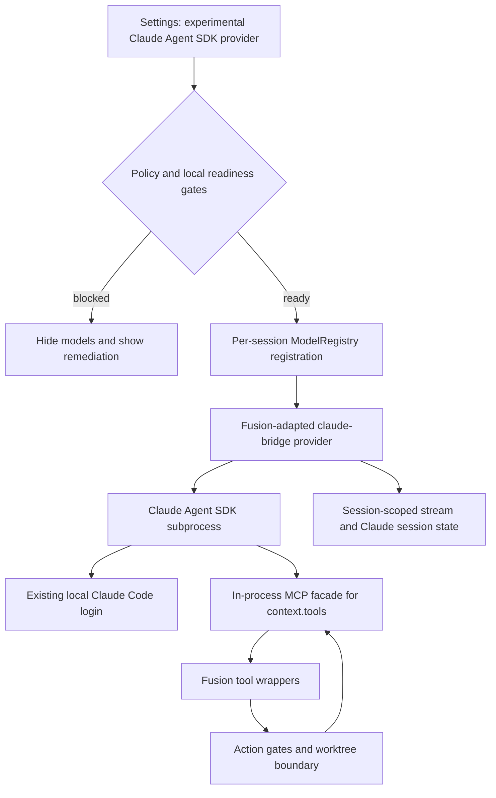
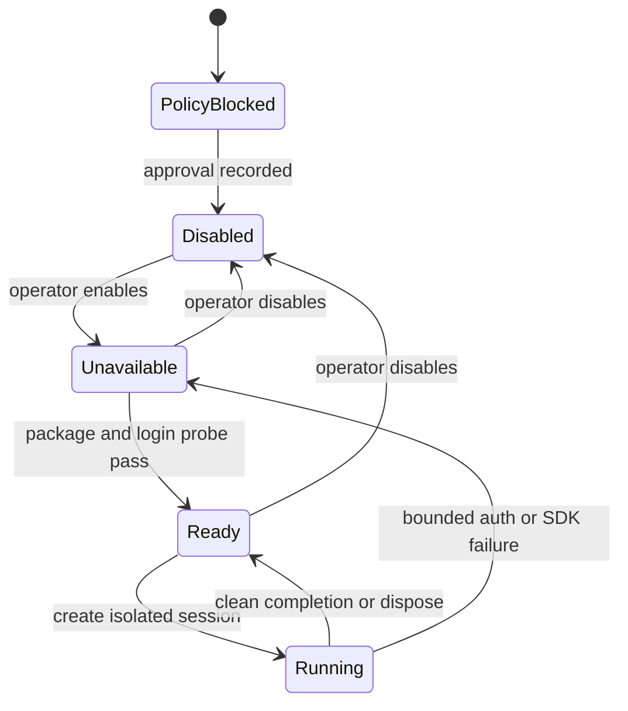
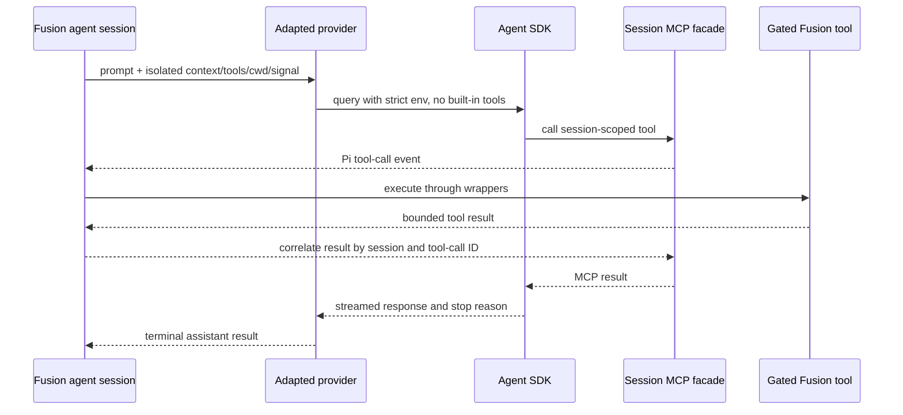

# Claude Agent SDK Bridge Provider - Plan

## Goal Capsule

- **Objective:** Decide safely whether Fusion should expose `pi-claude-bridge` as an additional Claude provider, and define the gated implementation if it is approved and proves compatible.
- **Authority:** Anthropic's current Agent SDK authentication policy and Fusion's credential, tool-gating, worktree-boundary, session-isolation, and multi-node invariants override upstream convenience behavior.
- **Execution profile:** Conditional delivery. U1 is a hard go/no-go gate; U2 is a Fusion compatibility spike. Product integration begins only if both pass.
- **Stop conditions:** Stop without product integration if Anthropic approval is absent, the provider cannot isolate simultaneous Fusion sessions, Fusion's tool boundary can be bypassed, or the adapted package cannot be pinned and audited.
- **Tail ownership:** If the gates pass, complete the experimental provider, focused verification, changeset, and operator documentation. Publishing remains an operator-only action outside task execution.

---

## Product Contract

### Summary

Do not add `pi-claude-bridge` as a supported authentication option in its current form. Evaluate it as a conditional, experimental Claude runtime provider: obtain written Anthropic approval for third-party claude.ai plan authentication, prove Fusion-compatible lifecycle and tool isolation, then ship a pinned adapted package behind a default-off toggle while preserving the existing `pi-claude-cli` provider.

### Problem Frame

Fusion already offers direct Anthropic API-key/OAuth paths and a separate `pi-claude-cli` provider that uses an authenticated local Claude CLI. `pi-claude-bridge` is attractive because it uses Anthropic's Agent SDK, streams Claude Code output, bridges Pi tools over in-process MCP, forwards skills, and preserves Claude Code sessions.

The upstream package is not an authentication adapter. It is a complete Pi extension with a provider, model catalog, process-global session state, tool-bridging behavior, and an `AskClaude` tool. Fusion can discover the extension through its existing Pi package manager, but its final model filter does not treat `claude-bridge` as configured, and the upstream lifecycle assumes a single Pi TUI session rather than many Fusion agent sessions.

The current official Agent SDK documentation is also a product gate: unless previously approved, third-party developers may not offer claude.ai login or rate limits and should use API-key authentication. A subscription-backed provider must therefore remain absent from supported Fusion surfaces until Anthropic grants applicable approval.

### Requirements

**Policy and product posture**

- R1. Fusion must not advertise, enable, or bundle subscription-backed `claude-bridge` authentication without written Anthropic approval that covers Fusion's third-party use of claude.ai login and plan rate limits.
- R2. The feature must be represented as an experimental runtime connection that reuses an existing Claude Code login, not as a Fusion-owned OAuth credential or API-key record.
- R3. The current Anthropic and `pi-claude-cli` providers must retain their existing IDs, credentials, models, settings, and runtime behavior.

**Runtime safety**

- R4. Every Fusion agent session must receive isolated bridge conversation state, abort handling, tool-result routing, and Claude session identity across simultaneous tasks, projects, worktrees, and models.
- R5. Claude may invoke only the Fusion tools supplied for that session, and every invocation must continue through Fusion's action gates and worktree/path boundary wrappers.
- R6. The adapted provider must disable upstream `AskClaude` registration and Claude built-in tools, force strict MCP configuration, suppress claude.ai cloud MCP servers, and reject configuration that weakens those constraints.
- R7. The Claude subprocess environment must be built from a documented allowlist and must not inherit unrelated engine secrets or provider credentials.
- R8. Missing login, unsupported model, SDK failure, stalled stream, malformed tool event, and session-resume failure must end in a bounded, actionable error rather than a hang, silent fallback, or cross-session reuse.

**Operator experience and rollout**

- R9. After U1 permits implementation, a default-off experimental provider card must report package availability, Claude login readiness, local-node capability, and the exact remediation for each unavailable state without exposing credentials.
- R10. Enabling the provider must add `claude-bridge` models to every model-selection lane; disabling it must remove them without altering saved selections for other providers.
- R11. The initial release must be local-node only unless remote nodes report an independently probed bridge capability; scheduling must not route a bridge-selected task to an incapable node.
- R12. The dependency must be pinned by npm version, integrity, and reviewed commit, with a documented update procedure and no PATH-resolved substitute.
- R13. The feature must ship with focused concurrency, security-boundary, model-visibility, auth-status, packaging, and failure-path coverage plus an operator-facing limitations document.

### Scope Boundaries

**In scope**

- A policy and provenance gate for subscription-backed Agent SDK use.
- A Fusion-owned, pinned adaptation of the provider-only functionality from `pi-claude-bridge`.
- Session isolation, tool-boundary enforcement, readiness/status reporting, model visibility, packaging, local-node rollout, tests, and documentation.

**Outside this plan**

- Replacing direct Anthropic API-key or OAuth inference.
- Replacing or deleting `pi-claude-cli` during the experimental rollout.
- Shipping the upstream `AskClaude` tool, full-mode delegation, user-installed Claude MCP servers, or claude.ai cloud MCP servers.
- Copying, importing, exporting, refreshing, or deleting Claude credentials in Fusion storage.
- Publishing a Fusion release or npm package from task execution.

#### Deferred to Follow-Up Work

- Promoting the provider from experimental to supported after a measured soak period.
- Choosing whether the Agent SDK transport should eventually replace the implementation behind `pi-claude-cli` rather than remain a second provider.
- Remote-node capability advertisement and scheduling after the local-node contract is stable.
- Upstreaming Fusion's lifecycle and security changes after their contracts are proven.

### Acceptance Examples

- AE1. Given no documented Anthropic approval, when an operator opens Authentication settings, then no supported `claude-bridge` connect action or selectable model is exposed.
- AE2. Given approval, the adapted package, and an authenticated local Claude Code installation, when the operator enables the experimental provider, then `claude-bridge/*` models appear without changing Anthropic or `pi-claude-cli` models.
- AE3. Given two concurrent tasks in different worktrees, when both use `claude-bridge`, then each sees only its own conversation, tools, results, cwd, abort signal, and persisted Claude session.
- AE4. Given a session-scoped tool protected by an action gate and worktree boundary, when Claude invokes it, then the same Fusion wrappers authorize and execute it; direct SDK or Claude built-in execution cannot bypass them.
- AE5. Given the local Claude login is absent or expired, when readiness is probed or a session starts, then the card and runtime return a bounded re-authentication instruction without writing a Fusion credential.
- AE6. Given the bridge is disabled or unavailable on the selected node, when models are listed or a task is routed, then bridge models are hidden or the task is rejected before session creation rather than falling back to another Claude provider.
- AE7. Given a user also installed upstream `pi-claude-bridge`, when Fusion loads extensions, then the pinned Fusion adaptation wins deterministically and duplicate `claude-bridge` registration cannot occur.

---

## Planning Contract

### Assessment and Recommendation

**Verdict: conditional no-go for first-class authentication today; technically feasible as an adapted experimental provider after two gates.** The upstream package is active and relevant—npm `0.6.2` was published on 2026-07-06, the repository is MIT-licensed, and its Pi peer range includes Fusion's pinned `0.80.10` line. Those facts make a spike credible, but they do not make a raw install production-compatible.

The strongest benefit is architectural: the Agent SDK supplies streaming, Claude Code session semantics, model selection, and an in-process MCP bridge that can return tool calls to Pi. The strongest costs are product duplication and ownership. Fusion would carry two subscription-backed Claude providers, a fast-moving model/entitlement catalog, another vendored fork, and a support surface whose core value depends on an external policy exception.

The upstream package has unresolved reliability issues around stalled SDK streams, leaked tool-call text, images outside the final user message, pruning, and compaction. More importantly, its `sharedSession`, active stream handler, and first-registration guard are process-global. Fusion creates a fresh model registry for each `createFnAgent` call and runs many concurrent sessions, so the upstream singleton behavior can omit the provider from later registries and mix session state across agents.

### Key Technical Decisions

- KTD1. **Policy approval precedes code.** Treat Anthropic approval as a hard external prerequisite, not a disclaimer. If approval is unavailable, record the outcome and stop; API-key-only Agent SDK use adds little beyond Fusion's direct Anthropic provider.
- KTD2. **Vendor an adapted provider instead of loading upstream directly.** Follow the existing `packages/pi-claude-cli` soft-fork and bundle pattern so Fusion can pin versions, remove incompatible features, and own lifecycle invariants. A user-installed extension remains unsupported experimentation.
- KTD3. **Expose a runtime connection, not another stored credential.** The provider card may enable/disable and probe the local Claude Code login, but Fusion does not import tokens, write `auth.json`, or claim ownership of logout. This matches existing CLI-provider semantics in `packages/dashboard/src/routes/register-auth-routes.ts` and `packages/dashboard/app/components/ClaudeCliProviderCard.tsx`.
- KTD4. **Keep a distinct experimental provider ID.** Use upstream's stable `claude-bridge` ID during the comparison period. Do not silently route `anthropic` or `pi-claude-cli` selections through the new transport.
- KTD5. **Make state session-scoped.** Replace `sharedSession`, `ACTIVE_STREAM_SIMPLE_KEY`, and module-global active-query coordination with state owned by the provider registration/session context and keyed by Fusion session identity. Every fresh Fusion `ModelRegistry` must receive its own valid registration.
- KTD6. **Preserve Fusion as the only tool authority.** Register no upstream `AskClaude` tool, pass `tools: []` to the Agent SDK, expose only `context.tools` through the bridge MCP server, and require those tool results to traverse Fusion's existing action-gate and boundary wrappers.
- KTD7. **Fail closed on environment and MCP configuration.** Replace `{ ...process.env }` inheritance with the smallest tested allowlist, always enable strict MCP, force cloud MCP off, and make unsafe overrides unavailable in the supported settings schema.
- KTD8. **Start local-node-only and default-off.** Model visibility is controlled by a new global experimental toggle plus local readiness. Multi-node scheduling remains ineligible until capability propagation is designed and tested.
- KTD9. **Pin source and package independently.** Pin `pi-claude-bridge@0.6.2`, its npm integrity, and reviewed commit `7e412185a62c2cdbbaee020de9e01e94e11d8851`; do not depend on an absent GitHub release tag or a floating semver range.

### High-Level Technical Design

### External Integration Evidence

- **Canonical upstream repo URL:** https://github.com/elidickinson/pi-claude-bridge
- **Docs / homepage URL:** https://github.com/elidickinson/pi-claude-bridge#readme
- **Release / download URL:** https://registry.npmjs.org/pi-claude-bridge/-/pi-claude-bridge-0.6.2.tgz
- **Package / extension identifier:** `pi-claude-bridge` (the package exposes a Pi extension and no standalone binary)
- **Checksum:** `sha512-+MGz9zSG4np4b/BnJOUatbXidSejQZXkj4vaIKIJzCfAEXLzFkarOxOdtKdnpNpk1aQUGCn1mXqUGkOtCFnOpg==`
- **Reviewed commit:** `7e412185a62c2cdbbaee020de9e01e94e11d8851` corresponding to npm `0.6.2`; GitHub has no `0.6.2` release asset or tag, so npm integrity is the release pin.
- **License:** MIT for `pi-claude-bridge`; Anthropic's Agent SDK is separately governed by Anthropic's Commercial Terms.

### Alternative Approaches Considered

1. **Load `npm:pi-claude-bridge` through the existing Pi Extensions manager.** Lowest implementation cost, but models are filtered from Fusion pickers, default `AskClaude` can bypass Fusion's orchestration boundary, process-global session state conflicts with concurrent agents, and support would float on upstream semver. Rejected for first-class support.
2. **Add the package as a custom OpenAI/Anthropic-compatible provider.** Not viable because it is a Pi `streamSimple` extension, not an HTTP model endpoint or credential adapter.
3. **Replace `pi-claude-cli` immediately.** Avoids duplicate UX but creates a high-risk migration with no soak path and couples existing users to Agent SDK policy and reliability. Deferred until the experimental provider produces comparative evidence.
4. **Adopt Agent SDK transport behind the existing `pi-claude-cli` ID.** Product-simpler long term, but it hides a material runtime change and prevents side-by-side comparison. Reconsider after the experiment.
5. **Use the Agent SDK only with `ANTHROPIC_API_KEY`.** Policy-safe and officially documented, but largely duplicates direct Anthropic inference while adding a Claude Code subprocess and tool bridge. Not worth a new provider unless a separate Agent SDK capability becomes compelling.

### Risks and Dependencies

- **Policy risk:** The current official Agent SDK overview disallows third-party claude.ai login/rate-limit offerings without prior approval. Mitigation: U1 blocks all implementation and UI exposure until written approval is stored in project documentation.
- **Session leakage risk:** Upstream singleton state was designed around one Pi process/session. Mitigation: U2 must prove two simultaneous Fusion sessions remain isolated before vendoring proceeds.
- **Tool bypass risk:** Upstream uses `permissionMode: "bypassPermissions"`; its separate `AskClaude` full mode can run writes and bash without Pi feedback. Mitigation: remove `AskClaude`, keep SDK built-ins empty, and verify only Fusion-wrapped tools execute.
- **Secret propagation risk:** Upstream passes the parent environment to the Claude process. Mitigation: use an explicit allowlist and a test with sentinel secrets proving they do not reach the subprocess.
- **Maintenance risk:** Model IDs, context entitlements, Agent SDK APIs, and Claude Code session files are changing quickly. Mitigation: exact pins, explicit update checklist, focused compatibility tests, and default-off rollout.
- **Reliability risk:** Open upstream issues include stalled streams, leaked tool-call text, image loss, pruning drift, and compaction complexity. Mitigation: bounded timeouts, fail-closed parsing, no promotion until a representative soak passes.
- **Multi-node risk:** Authentication and package availability are machine-local while Fusion settings are shared. Mitigation: local-node-only initial scope and no remote scheduling without a node capability signal.

### System-Wide Impact

- **Credential ownership:** `packages/engine/src/auth-storage.ts` remains authoritative only for Fusion-managed credentials. The bridge reads the local Claude Code login through the Agent SDK; enable, disable, status, and failure paths must not create a synthetic secret, hydrate `auth.json`, refresh a token, or implement logout.
- **Provider registration:** `packages/engine/src/pi.ts` creates a new model runtime and registry per `createFnAgent` call. The adapted extension must register independently into each registry while keeping session state out of module globals. Dashboard model discovery and runtime session creation must apply the same enablement/readiness contract.
- **Tool and approval path:** The bridge converts session `context.tools` into an MCP facade, but the callable handlers remain the exact wrapped definitions assembled by `createFnAgent`. Read-only filtering, tool allowlists, action gates, permanent-agent gates, worktree boundaries, aborts, and result correlation must behave identically to other Pi providers.
- **Model-selection parity:** Default, execution, planning, validation, merger, summarization, workflow-node, durable-agent, and fallback surfaces store explicit provider/model pairs. The new provider must appear additively in all shared selectors and must never cause a saved direct-Anthropic or Claude CLI selection to change provider.
- **Process lifecycle:** Every SDK query must be supervised through the owning agent session's abort/dispose lifecycle. A timeout or task cancel closes only that query, drains its pending tool handlers, and leaves no orphan Claude process or callback that can write into a successor session.
- **Multi-node behavior:** The toggle is shared but login/package capability is machine-local. Initial implementation must reject remote placement rather than infer capability from the coordinator; later node support requires an explicit capability report keyed to node and provider version.
- **Operational visibility:** Logs and audit events may include provider ID, pinned version, node ID, session ID, outcome, timeout category, and counts. They must not persist prompts, tool arguments/results, credential material, SDK environment values, or Claude transcript content.

---

## Implementation Units

### U1. Resolve policy and provenance gate

- **Goal:** Produce the go/no-go evidence that determines whether subscription-backed integration may proceed.
- **Requirements:** R1, R2, R12.
- **Dependencies:** none.
- **Files:**
  - `docs/upstream/pi-claude-bridge-policy-and-provenance.md` (new)
  - `docs/settings-reference.md`
- **Approach:** Ask Anthropic for written approval covering Fusion's third-party use of claude.ai login and plan rate limits through the Agent SDK. Record the approving scope, date, limitations, reviewed upstream commit, npm integrity, license/terms boundary, and update owner. If approval is denied, absent, or narrower than the proposed feature, document the no-go and stop before U2. Do not interpret an authenticated local Claude installation or observed quota behavior as policy approval.
- **Patterns to follow:** `docs/upstream/claude-code-cli-acp-mcp-permission-forwarding.md`; the External Integration Evidence format in `plugins/fusion-plugin-acp-runtime/AGENTS.md`.
- **Test scenarios:** Test expectation: none — this is a governance and provenance gate whose verification is documentary evidence from Anthropic plus independently checked package metadata.
- **Verification:** A reviewer can locate the approval, match it to the proposed product behavior, and reproduce the package/commit/integrity facts. Without that evidence, the documented outcome is no-go and no later unit starts.

### U2. Prove Fusion lifecycle compatibility in an isolated spike

- **Goal:** Establish that the provider can be adapted to Fusion's per-call registries and concurrent session lifecycle without state leakage.
- **Requirements:** R4, R5, R8.
- **Dependencies:** U1.
- **Files:**
  - `packages/engine/src/__tests__/fixtures/pi-claude-bridge/` (new fake SDK/provider fixtures)
  - `packages/engine/src/__tests__/pi-claude-bridge-compatibility.test.ts` (new)
  - `docs/upstream/pi-claude-bridge-policy-and-provenance.md`
- **Approach:** Build a non-production harness around a pinned source snapshot and a fake Agent SDK query. Exercise two separate `createFusionModelRegistry` plus extension-load cycles and simultaneous sessions with different cwd, histories, tools, tool-call IDs, abort signals, and model IDs. Demonstrate the failures caused by upstream global `ACTIVE_STREAM_SIMPLE_KEY`, `sharedSession`, and active-query coordination, then prove a session-owned design removes them. Record a hard no-go if isolation requires sharing conversation or tool state across registries.
- **Execution note:** Start with concurrency tests that fail against unmodified upstream behavior; the original incompatibility must remain visible as the reason adaptation is required.
- **Patterns to follow:** `packages/engine/src/__tests__/pi-create-fn-agent.test.ts`; provider registration in `packages/engine/src/pi.ts`; the provider-isolation approach in `packages/pi-claude-cli`.
- **Test scenarios:**
  - Two fresh registries each receive `claude-bridge` despite module caching and prior provider registration.
  - Two simultaneous sessions with distinct histories and cwd values receive only their own streamed text and Claude session ID.
  - Interleaved identical tool names and different tool-call IDs return results to the correct session.
  - Aborting one session closes only its SDK query and leaves the other session running.
  - Disposing and recreating one session does not clear or reuse the other's state.
- **Verification:** The focused compatibility test proves the invariant across two registries and two concurrent sessions, and the provenance document records the spike verdict.

### U3. Vendor and harden the provider-only adaptation

- **Goal:** Create a pinned Fusion package that registers only the `claude-bridge` provider and enforces Fusion's security boundary.
- **Requirements:** R4-R8, R12.
- **Dependencies:** U2.
- **Files:**
  - `packages/pi-claude-bridge/` (new vendored adaptation, including `UPSTREAM.md` and retained `LICENSE`)
  - `packages/pi-claude-bridge/src/__tests__/provider-registration.test.ts` (new)
  - `packages/pi-claude-bridge/src/__tests__/session-isolation.test.ts` (new)
  - `packages/pi-claude-bridge/src/__tests__/security-boundary.test.ts` (new)
  - `packages/core/src/pi-extensions.ts`
  - `packages/core/src/__tests__/reconcile-claude-bridge-paths.test.ts` (new)
  - `pnpm-workspace.yaml`
  - `pnpm-lock.yaml`
- **Approach:** Fork the pinned provider path, remove the `AskClaude` tool and UI dependencies, and replace process-global lifecycle state with explicit provider/session state. Reconcile extension paths so the Fusion adaptation wins over user-installed upstream copies. Force `tools: []`, strict MCP, cloud MCP suppression, a fixed environment allowlist, bounded inactivity/total timeouts, typed terminal failures, and exact correlation of tool results by session plus tool-call ID. Preserve upstream attribution and document every intentional divergence.
- **Patterns to follow:** `packages/pi-claude-cli/package.json`, `packages/pi-claude-cli/UPSTREAM.md`, `packages/core/src/pi-extensions.ts`, and `packages/core/src/__tests__/reconcile-claude-cli-paths.test.ts`.
- **Test scenarios:**
  - Every registry load registers one `claude-bridge` provider with no global winner from an earlier registry.
  - Provider registration exposes no `AskClaude` tool.
  - The SDK receives no built-in tools, always receives strict MCP/cloud-MCP-off settings, and rejects unsafe override attempts.
  - The effective SDK tool inventory at query start contains only the session MCP facade; Claude built-ins, user-configured MCP servers, cloud MCP servers, and setting-source tools cannot execute even while the SDK subprocess uses its required permission mode.
  - Sentinel engine secrets and unrelated provider keys are absent from the child environment while required HOME/PATH/config variables remain available.
  - A Fusion tool call travels through the supplied context tool and returns its exact result; an unknown tool is rejected.
  - Stream inactivity, total timeout, malformed events, resume failure, and abort each produce one terminal result and release all pending handlers.
  - An external `pi-claude-bridge` install is removed from the load list and the vendored entry appears once.
- **Verification:** Package tests prove registration, isolation, environment, tool, timeout, and collision invariants without a real network or Claude account.

### U4. Add experimental settings, readiness, and authentication surfaces

- **Goal:** Give operators an accurate default-off connection/status experience without storing Claude credentials.
- **Requirements:** R2, R3, R8-R11.
- **Dependencies:** U3.
- **Files:**
  - `packages/core/src/types.ts`
  - `packages/core/src/settings-schema.ts`
  - `packages/core/src/__tests__/use-claude-bridge-settings.test.ts` (new)
  - `packages/dashboard/src/claude-bridge-probe.ts` (new)
  - `packages/dashboard/src/routes/register-auth-routes.ts`
  - `packages/dashboard/src/__tests__/routes-auth.test.ts`
  - `packages/dashboard/app/api/legacy.ts`
  - `packages/dashboard/app/components/ClaudeBridgeProviderCard.tsx` (new)
  - `packages/dashboard/app/components/ClaudeBridgeProviderCard.css` (new)
  - `packages/dashboard/app/components/settings/sections/AuthenticationSection.tsx`
  - `packages/dashboard/app/components/__tests__/ClaudeBridgeProviderCard.test.tsx` (new)
  - `packages/dashboard/app/components/__tests__/AuthenticationSection.test.tsx`
  - `packages/dashboard/app/components/__tests__/AuthenticationSection.modelsCacheRefresh.test.tsx`
- **Approach:** After U1 has permitted implementation, add `useClaudeBridge` as a global default-off experimental toggle. Add a synthetic CLI/runtime card that distinguishes package-missing, Claude-login-missing, ready-disabled, ready-enabled, node-incapable, and probe-error states. Probe without mutating credentials and label enable/disable as connection state rather than login/logout. Reuse the existing card primitives, auth route patterns, and model-cache refresh behavior; add no parallel styling primitives. Policy approval is a pre-implementation gate, not a runtime document-presence check.
- **Patterns to follow:** `packages/dashboard/app/components/ClaudeCliProviderCard.tsx`, `packages/dashboard/src/routes/register-auth-routes.ts`, `packages/dashboard/app/components/settings/sections/AuthenticationSection.tsx`, and design tokens in `packages/dashboard/app/styles.css`.
- **Test scenarios:**
  - Covers AE2. Ready plus enabled reports connected and triggers one shared model-cache refresh.
  - Covers AE5. Missing or expired Claude login reports disconnected with a local re-authentication instruction and writes no Fusion auth credential.
  - Package missing, node incapable, incompatible SDK, probe timeout, and malformed probe output remain distinct actionable states.
  - Disable preserves other provider settings and never invokes Claude logout or deletes Claude files.
  - Desktop and server-hosted dashboard paths return the same status shape.
  - Loading and terminal states expose an accessible provider name, connection status, and remediation; enable/disable remains keyboard operable.
  - The new card participates in existing authenticated/available ordering on desktop and mobile without empty shells or orphan controls.
- **Verification:** Focused core, dashboard route, and component tests prove state mapping, no credential mutation, and cross-surface parity.

### U5. Wire model visibility and session creation

- **Goal:** Make enabled bridge models selectable and executable across Fusion lanes while failing closed on unavailable nodes.
- **Requirements:** R3-R5, R8, R10, R11.
- **Dependencies:** U3, U4.
- **Files:**
  - `packages/engine/src/pi.ts`
  - `packages/engine/src/mcp-runtime-support.ts`
  - `packages/engine/src/node-dispatch-validation.ts`
  - `packages/engine/src/scheduler.ts`
  - `packages/engine/src/runtimes/in-process-runtime.ts`
  - `packages/engine/src/__tests__/pi-create-fn-agent.test.ts`
  - `packages/engine/src/__tests__/mcp-runtime-support.test.ts`
  - `packages/engine/src/__tests__/node-dispatch-validation.test.ts`
  - `packages/engine/src/__tests__/scheduler-node-unreachable-audit.test.ts`
  - `packages/dashboard/src/routes/register-model-routes.ts`
  - `packages/dashboard/src/__tests__/routes-auth.test.ts`
  - `packages/dashboard/app/components/ProviderIcon.tsx`
  - `packages/dashboard/app/components/__tests__/ProviderIcon.test.tsx`
  - `packages/dashboard/app/components/__tests__/ModelSelectorTab.test.tsx`
  - `packages/dashboard/app/components/__tests__/CustomModelDropdown.test.tsx`
- **Approach:** Resolve and load the vendored entry for every fresh registry, conditionally allowlist `claude-bridge` through the final model filter, and pass the selected model unchanged to session creation. Mark the provider MCP-capable only after U3 proves context tools remain gated. Extend node-dispatch validation with the task's resolved provider so a bridge-selected task is blocked before dispatch whenever its effective node is remote; retain the runtime readiness check as a second fail-closed boundary. Never reroute to `anthropic`, `pi-claude-cli`, or local execution under the unavailable-node fallback policy.
- **Patterns to follow:** `resolveVendoredClaudeCliEntry` and `registerExtensionProviders` in `packages/engine/src/pi.ts`; CLI-provider allowlisting in `packages/dashboard/src/routes/register-model-routes.ts`; existing Claude provider icons and model-lane tests.
- **Test scenarios:**
  - Covers AE2. Enabled and ready adds each `claude-bridge` model exactly once alongside existing Claude providers.
  - Covers AE6. Disabled, package-missing, or node-incapable states hide models and reject stale saved selections before SDK query creation.
  - Covers AE3. Executor, planning, validation, merger, summarization, and durable-agent selections all preserve the explicit `claude-bridge/model` pair.
  - A bridge-selected task with a remote effective node remains queued with a provider-capability reason under both `block` and `fallback-local`; no remote dispatch or silent local fallback occurs.
  - No selected bridge model silently reroutes to direct Anthropic or `pi-claude-cli` after readiness failure.
  - MCP server forwarding occurs only for the bridge provider and continues to use the session's wrapped tool list.
  - Existing Anthropic and `pi-claude-cli` visibility tests remain byte-for-byte equivalent when the new toggle is unset.
- **Verification:** Focused engine and dashboard tests prove model additivity, lane parity, MCP gating, and fail-closed session creation.

### U6. Package, document, and soak the experimental provider

- **Goal:** Ship a reviewable local-node experiment with reproducible provenance and an explicit promotion decision.
- **Requirements:** R11-R13.
- **Dependencies:** U3-U5.
- **Files:**
  - `packages/cli/package.json`
  - `packages/cli/tsup.config.ts`
  - `packages/cli/scripts/prepare-publish-manifest.mjs`
  - `packages/cli/src/__tests__/bundle-output.test.ts`
  - `packages/cli/src/__tests__/plugin-pack-shape.test.ts`
  - `docs/settings-reference.md`
  - `docs/agents.md`
  - `docs/testing.md`
  - `.changeset/<generated-name>.md` (new)
- **Approach:** Stage the raw TypeScript adaptation in the published CLI bundle using the existing `pi-claude-cli` pattern, but keep the Agent SDK and its required runtime packages in the prepared publish manifest rather than assuming source staging bundles them. Preserve optional platform-native artifacts through pack/install and fail with a provider-specific setup error when the current platform artifact is unavailable. Document policy prerequisites, enablement, credential ownership, local-node limit, model entitlements, security posture, diagnostics, and removal. Add a labeled minor changeset because this adds an operator-visible provider. Run a bounded soak matrix outside CI with two concurrent sessions, mixed tool/no-tool turns, abort, compaction, provider switching, and a long stream; record results in the provenance document before considering promotion.
- **Patterns to follow:** `packages/cli/tsup.config.ts` staging for `pi-claude-cli`; `packages/cli/src/__tests__/bundle-output.test.ts`; required changeset field format in `AGENTS.md`.
- **Test scenarios:**
  - Published-package staging contains the adapted source, retained license, upstream provenance, exact dependencies, and correct Pi extension manifest.
  - `pnpm pack` followed by an install into a clean fixture preserves the Agent SDK dependency and the supported platform's optional native artifact without resolving workspace packages.
  - A source-checkout and staged-package load each register the same provider and models.
  - Missing optional native Agent SDK dependency produces a setup error without breaking Fusion boot or unrelated providers.
  - Package preparation removes workspace-only dependencies without removing runtime dependencies.
  - Changeset strict validation accepts a one-line operator-facing summary, `category: feature`, and useful developer note.
  - Soak evidence covers AE3-AE7 and records durations, outcomes, and failures without credentials or prompt content.
- **Verification:** Focused bundle-shape tests, package smoke loading, documentation review, changeset lint, and the recorded soak matrix satisfy the experimental-release contract.

---

## Verification Contract

| Gate | Scope | Done signal |
|---|---|---|
| Policy/provenance review | U1 | Written Anthropic approval matches the proposed third-party subscription behavior, or the plan terminates as documented no-go. |
| Compatibility tests | U2 | Two registries and two concurrent sessions remain isolated under interleaved streams, tools, aborts, and disposal. |
| Provider package tests | U3 | Registration, security boundary, environment allowlist, timeout, collision, and failure-path tests pass with fake SDK seams. |
| Core/dashboard focused tests | U4-U5 | Setting, auth status, component, models route, lane selection, and MCP support tests pass without the full suite. |
| Packaging checks | U6 | CLI bundle-output and plugin-pack-shape tests prove the adapted package is included with exact provenance and dependencies. |
| Static verification | All code units | Scoped typecheck/build and `pnpm verify:fast` succeed; lint remains clean. |
| Behavioral soak | U6 | Concurrent local sessions complete the documented matrix with no context/tool leakage, silent fallback, hang, or orphan subprocess. |

Verification must stay file-scoped during implementation. Use the thin merge gate for cross-cutting confidence rather than opting into the full suite. Any observed unrelated flaky test is quarantined according to the repository deletion ratchet; do not widen timeouts or add retries to appease it.

---

## Definition of Done

- U1 records applicable Anthropic approval and exact upstream provenance, or the effort ends with a documented no-go and no integration diff.
- U2 proves Fusion-compatible registration and session isolation before production package work starts.
- U3 provides a pinned, attributed provider-only adaptation with no `AskClaude`, no unsafe environment inheritance, and no tool path outside Fusion wrappers.
- U4 exposes accurate default-off readiness and enablement without storing or deleting Claude credentials.
- U5 preserves explicit provider/model selections across every lane and fails closed on unavailable nodes without fallback.
- U6 stages the package, documents limitations, adds a valid minor changeset, and records a clean bounded soak.
- Existing Anthropic and `pi-claude-cli` behavior and tests remain unchanged when `useClaudeBridge` is unset.
- No abandoned spike code, temporary fixtures, debug logging with secrets/prompts, duplicate provider registration, or unused UI shells remain in the final diff.
- No release or publish command is run during task execution.

---

## Sources and Research

- [`pi-claude-bridge` repository and README](https://github.com/elidickinson/pi-claude-bridge) — provider behavior, configuration, maintenance notes, model catalog, and session/tool architecture.
- [`pi-claude-bridge` npm package](https://www.npmjs.com/package/pi-claude-bridge) — version `0.6.2`, publish timestamp, dependency/peer ranges, and integrity.
- [Anthropic Agent SDK overview](https://platform.claude.com/docs/en/agent-sdk/overview) — supported API-key/provider authentication and the restriction on third-party claude.ai login/rate limits without approval.
- [Anthropic Agent SDK TypeScript reference](https://platform.claude.com/docs/en/agent-sdk/typescript) — permission mode, tool, environment, subprocess, and session options.
- [Anthropic Agent SDK TypeScript repository](https://github.com/anthropics/claude-agent-sdk-typescript) — SDK terms, data-use notice, and package source.
- `packages/engine/src/pi.ts` — per-`createFnAgent` model registry construction, extension provider loading, and wrapped tool/session creation.
- `packages/core/src/pi-extensions.ts` — Pi package discovery and vendored-provider collision reconciliation.
- `packages/engine/src/provider-auth.ts` and `packages/engine/src/auth-storage.ts` — current credential ownership and Anthropic API-key/subscription separation.
- `packages/dashboard/src/routes/register-auth-routes.ts` and `packages/dashboard/src/routes/register-model-routes.ts` — CLI-provider readiness, toggle, and configured-provider filtering patterns.
- `packages/pi-claude-cli/` — existing vendored Claude provider, provenance, packaging, MCP, and failure-handling precedent.
- `docs/plans/2026-06-14-001-feat-claude-acp-runtime-plan.md` — prior Claude bridge evaluation, environment allowlist, MCP/tool permission concerns, and fail-closed rollout posture.
